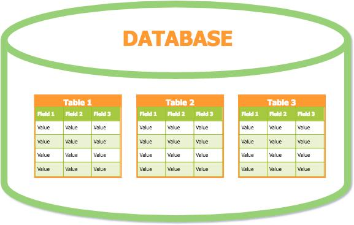
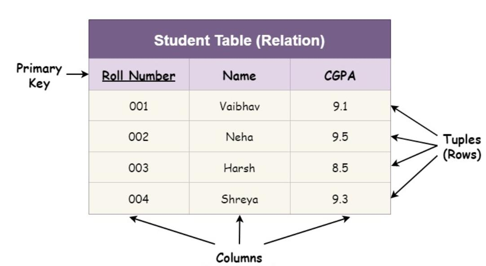

## DataBase

 - A Database is a place where data is stored, organized, and managed 
 - so it can be easily accessed later.


#### Simple Example

- Think about a college:
```
    Student details
    Teacher details
    Course details
```
### diagram


### Table 

- A Table is where data is stored in a database.
- It looks like an Excel sheet
- Contains rows and columns

#### 📄 Row
- A Row represents one complete record

#### Column

- A Column represents a type of data (field)




