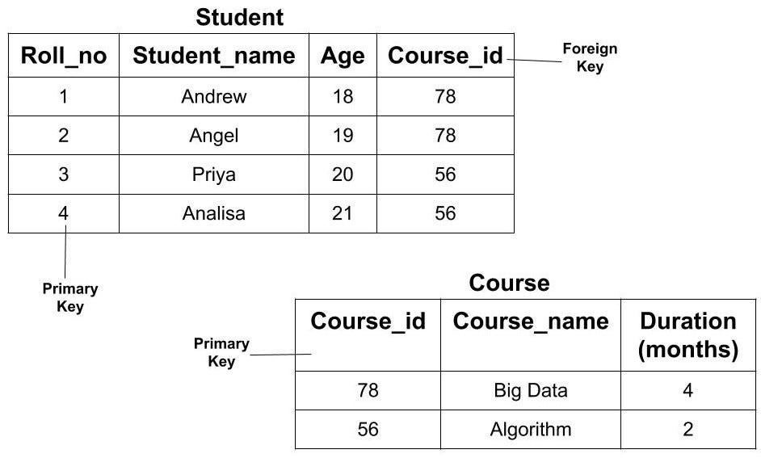

# RDBMS
-  RDBMS = Relational Database Management System
-  RDBMS = Multiple tables + links between them

##  Why RDBMS is used?
- Avoid duplicate data
- Organize data better
- Easy to query using SQL
- Maintain relationships between data